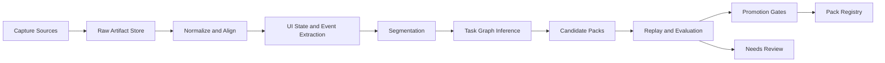
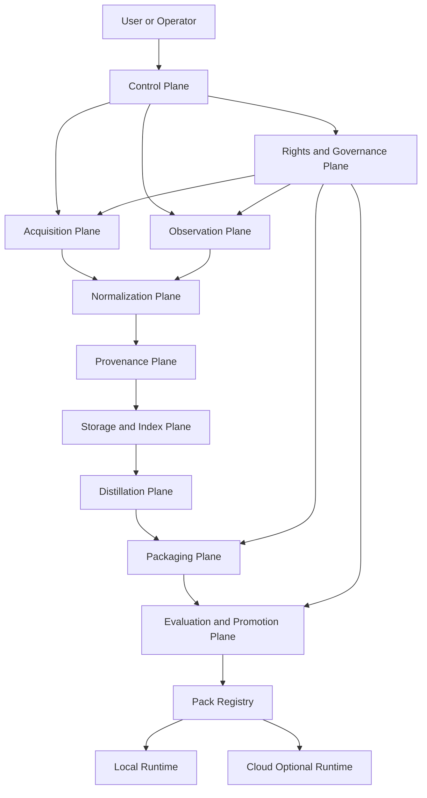

# DANTEHARVEST Decision Dossier

## Executive Summary

My verdict is to build **DANTEHARVEST next**, but **not** by forking DanteDistiller into a new monolith. The right move is a **clean-room Harvest repo with DanteDistiller embedded as a read-only donor**, followed by **selective organ transplants** of its strongest primitives: provenance, evidence packaging, run contracts, fail-closed guardrails, and parts of ingest/normalization. The reason is simple: DanteDistiller already solved several high-value trust and audit problems, while the live OSS ecosystem now offers much stronger patterns for browser automation, crawl reliability, continuous screen memory, GUI demonstration capture, and open deep-research orchestration than DanteDistiller itself implements. Browser operator patterns are materially more advanced in Browser Use, Stagehand, Skyvern, and Playwright; collection and normalization patterns are stronger in Firecrawl, Crawl4AI, Crawlee, Jina Reader, MarkItDown, and Paperless-ngx; continuous computer observation and apprenticeship data patterns are stronger in OpenAdapt, UI-TARS, OpenCUA, CUA-Suite, Screenpipe, OpenRecall, and Clicky; and research substrate patterns are stronger in Open Deep Research, Jina MCP, and OpenResearcher. citeturn12view0turn12view1turn12view2turn1view3turn9view5turn12view7turn7view8turn12view3turn9view10turn7view2turn7view3turn7view1turn9view2turn12view5turn7view6turn7view7turn9view3

The most important product insight is this: **DANTEHARVEST should not begin as “an autonomous computer-use model.”** It should begin as a **rights-governed acquisition, observation, distillation, and packaging system** that can later feed specialized agents, eval sandboxes, and sovereign fine-tuning. In other words, Harvest’s first job is to **capture and structure evidence-rich knowledge and procedures**; only later should it promote high-confidence procedures into reusable packs or autonomous execution surfaces. That sequencing matches both the strongest OSS patterns and the biggest gap in your current Dante universe. citeturn7view7turn9view3turn7view1turn9view2turn12view5turn7view4

The blunt recommendation is:

- **Build DANTEHARVEST now.**
- **Embed DanteDistiller as a donor, not as the live core.**
- **Transplant governance/evidence/export first.**
- **Integrate best-of-breed OSS for crawl, browser, and screen memory.**
- **Do not ship a full autonomous desktop agent in v1.**
- **Do ship a “computer apprenticeship” pipeline in v1.5: capture → align → infer procedure → test → promote to pack.**

## Internal Donor Audit

I extracted and traversed the embedded donor repo locally. At the top level, the donor is broad and ambitious: `backend/`, `frontend/`, `cli/`, `docs/`, `tests/`, `scripts/`, `monitoring/`, `k8s/`, `terraform/`, `storage/`, `logs/`, plus root-level packaging, compose, and bootstrap files. The strongest parts are the backend evidence/provenance/export contracts and the planning corpus under `docs/`. The weakest parts, relative to DANTEHARVEST, are the absence of desktop observation, the lack of a real computer-apprenticeship data model, and several duplicated or partially overlapping implementations that would create drag if carried forward unchanged.

A few high-signal repo observations from the donor:

- There is a strong **audit spine** in `backend/storage/chain_writer.py`, `backend/models/chain_entry.py`, `backend/models/signals.py`, `backend/export/export_manifest.py`, and `backend/export/evidence_package_builder.py`.
- There is a usable **web acquisition spine** in `backend/utils/robots_validator.py`, `backend/machines/harvester/playwright_engine.py`, and `backend/machines/dynamic_harvester_machine.py`.
- There is a usable **OCR/chunking spine** in `backend/machines/normalize/ocr_engine.py`, `backend/machines/normalize/image_preprocessor.py`, `backend/parsers/text_chunker.py`, and `backend/chunking/`.
- There is only **partial media handling** in `backend/machines/transcribe_machine.py`, `backend/machines/transcribe/whisper_engine.py`, and `backend/transcribe/keyframes.py`.
- There is **no real desktop-observation system**. I found no donor module for continuous screen capture, mouse/keyboard/window event collection, desktop UI-state extraction, replay traces, or human demonstration distillation.
- There are multiple **duplication smells**:
  - `backend/export/audit_bundle.py` versus `backend/export/evidence_package_builder.py`
  - `backend/embedding/hybrid_search.py` versus `backend/search/hybrid_search.py`
  - `backend/storage/chain_writer.py` versus compatibility logic in `backend/utils/provenance.py`
- The repo also contains **generated artifacts and bloat** that should not become the foundation of Harvest:
  - `frontend/dist/`
  - `frontend/playwright-report/`
  - `frontend/test-results/`
  - `storage/`
  - `logs/`

### Top-level donor inventory

| Folder | What it contains | Harvest take |
|---|---|---|
| `backend/` | Core machines, API, models, exports, provenance, search, MCP, config | **Primary donor** |
| `frontend/` | React UI, pages, evidence viewers, export flows, plus built/test artifacts | **Selective donor; trim aggressively** |
| `cli/` | Bootstrap/status/doctor surface | **Low-priority donor** |
| `docs/` | Planning corpus, contracts, masterplan, track docs | **High-value donor** |
| `tests/` | Unit/integration/e2e/adversarial/certification | **High-value donor** |
| `scripts/` | Bootstrap/release/install helpers | **Partial donor** |
| `monitoring/` | Prometheus/exporter support | **Later donor** |
| `k8s/`, `terraform/` | Deployment scaffolding | **Defer** |
| `storage/`, `logs/` | Generated artifacts and local state | **Do not transplant** |

### Planning document extraction

| Path | Title | Short summary | Signal vs bloat | Action |
|---|---|---|---|---|
| `docs/masterplan_alignment.md` | Dante Distiller V2 - Masterplan Alignment | Best short-form statement of machine sovereignty, one-door doctrine, evidence chain, and fail-closed defaults | **High signal** | Promote |
| `docs/V2/DanteDistiller_Technical_Stack.md` | DanteDistiller Technical Stack & Architecture Specification | Strong stack and structure reference; useful for naming, boundaries, and infra patterns | **High signal** | Promote |
| `docs/V2/QUICKREF_DanteDistiller.md` | DanteDistiller - Quick Reference Guide | Developer-facing naming and implementation conventions | **Medium signal** | Promote |
| `docs/V2/Final Version DanteDistiller V+E Masterplan.pdf` | V+E Masterplan | Canonical strategic framing; valuable as legacy doctrine, not as Harvest source of truth | **High signal** | Promote as legacy foundation |
| `docs/council/contracts.md` | CALP Contracts | Concrete API/event/artifact contracts; very useful for Harvest contracts | **High signal** | Promote |
| `docs/council/budget_contract.md` | Budget Contract | Good governance donor for run limits and fail-closed enforcement | **High signal** | Promote |
| `docs/council/websocket_contract.md` | WebSocket Contract | Useful if Harvest needs live run monitors | **Medium signal** | Promote |
| `docs/runbooks/backup-restore.md` | Backup/Restore Runbook | Practical but late-stage operational material | **Medium signal** | Archive for later |
| `docs/tracks/track_k_mandate.md` | TRACK K Mandate | Good example of narrow machine mandate writing | **Medium signal** | Promote as style donor |
| `docs/V2/TRACK I…`, `TRACK D…`, `TRACK N…`, `TRACK O…`, `TRACK P…`, `TRACK T…` | Machine donor inventories | Useful because they encode “donor-first” thinking, but they are mostly prompt residue and partial inventories rather than authoritative product specs | **Mixed** | Archive under legacy reference |
| `docs/MCP_DEVELOPMENT.md`, `MCP_EXAMPLES.md`, `MCP_TROUBLESHOOTING.md`, `README_MCP.md` | MCP module docs | Useful only if Harvest ships an MCP server early | **Medium signal** | Archive, do not promote yet |
| `docs/council/backlog.md`, `cycle-log.md`, `break-reports/*`, `V2/Deliverables.txt`, `V2/Addendum A — Council Assembly Line.txt` | Planning exhaust, delivery bookkeeping, council process | Historical context only | **Low signal / bloat** | Archive or retire |

### Capability salvage matrix

| Capability | Donor paths | Product fit | Code maturity | Transplant difficulty | Rewrite risk | Relevance to v1 | Recommendation |
|---|---|---:|---:|---:|---:|---:|---|
| Ingest | `backend/machines/ingest_machine.py` | High | Medium | Medium | Medium | High | **Rewrite around source adapters; preserve ownership/hash contract ideas** |
| Crawl/scrape | `backend/machines/dynamic_harvester_machine.py`; `backend/machines/harvester/playwright_engine.py`; `backend/utils/robots_validator.py` | High | Medium | Medium | Medium | High | **Transplant `robots_validator.py` and Playwright wrapper; rewrite harvester orchestration** |
| Browser observe | Only partial screenshot/network capture in harvester paths | High | Low | High | High | Medium | **Build new** |
| Desktop observe | **No donor module found** | High | None | High | High | Medium | **Build new from external donors** |
| OCR | `backend/machines/normalize/ocr_engine.py`; `backend/machines/normalize/image_preprocessor.py` | High | Medium | Low | Low | High | **Transplant now behind abstract OCR engine interface** |
| Transcribe | `backend/machines/transcribe_machine.py`; `backend/machines/transcribe/whisper_engine.py`; `backend/transcribe/keyframes.py` | Medium | Low-Med | Medium | High | Medium | **Transplant `keyframes.py`; rewrite transcription service to a single engine** |
| Alignment | Only timestamps/keyframes, no canonical alignment store | High | Low | High | Medium | Medium | **Build new** |
| Citation/provenance | `backend/machines/citation_machine.py`; `backend/storage/chain_writer.py`; `backend/models/chain_entry.py`; `backend/export/export_manifest.py` | High | High | Medium | Low | High | **Transplant provenance/export now; defer citation heavy features** |
| Chunking | `backend/parsers/text_chunker.py`; `backend/chunking/*`; `backend/models/chunk.py` | High | Medium | Medium | Medium | High | **Transplant interfaces and tests; rewrite policies** |
| Knowledge graph | `backend/machines/knowledge_graph_machine.py`; `backend/knowledge/*` | Medium | Medium | Medium | Medium | Low | **Defer** |
| Index/search | `backend/machines/embed_machine.py`; `backend/vector/qdrant_client.py`; `backend/embedding/*`; `backend/search/*` | High | Medium | High | Medium | High | **Keep storage abstractions only; rewrite search stack to remove duplication** |
| Pack generation/export | `backend/export/evidence_package_builder.py`; `backend/export/export_manifest.py`; `backend/export/audit_bundle.py`; `backend/machines/exporter_machine.py` | High | High | Medium | Low | High | **Transplant manifest/package builder; retire duplicate bundle path** |
| Orchestration | `backend/machines/orchestrator.py`; `backend/services/pipeline_executor.py` | High | Medium | Medium | Medium | High | **Transplant one-door doctrine, but rewrite scheduler/execution core** |
| Eval/governance | `backend/certification/gates.py`; `backend/budget/*`; `backend/constitutional/*`; `backend/mcp/mcp_guards.py` | High | High | Medium | Low | High | **Transplant now** |

### Exact transplant-first list

These are the donor files I would transplant into DANTEHARVEST first, with light edits and strong tests:

| Priority | Exact donor path | Why transplant |
|---|---|---|
| First | `backend/storage/chain_writer.py` | Best append-only evidence primitive in repo |
| First | `backend/models/chain_entry.py` | Canonical evidence event shape |
| First | `backend/models/signals.py` | Lifecycle and run-state contract base |
| First | `backend/export/export_manifest.py` | Strong deterministic artifact manifest |
| First | `backend/export/evidence_package_builder.py` | Evidence bundle backbone for Harvest receipts |
| First | `backend/utils/robots_validator.py` | Valuable hard-stop policy gate |
| First | `backend/machines/harvester/playwright_engine.py` | Good low-level browser fetch wrapper |
| First | `backend/machines/normalize/ocr_engine.py` | Simple OCR donor behind future abstraction |
| First | `backend/machines/normalize/image_preprocessor.py` | Practical preprocessing donor |
| First | `backend/transcribe/keyframes.py` | Reusable keyframe extraction utility |
| First | `docs/masterplan_alignment.md` | Best doctrinal donor |
| First | `docs/V2/DanteDistiller_Technical_Stack.md` | Useful architecture donor |
| First | `docs/council/contracts.md` | High-value contract donor |
| First | `docs/council/budget_contract.md` | Governance donor |

These should **not** be transplanted as-is:

- `backend/export/audit_bundle.py`
- `backend/embedding/hybrid_search.py`
- `backend/search/hybrid_search.py`
- `backend/utils/provenance.py`
- `frontend/dist/`
- `frontend/playwright-report/`
- `frontend/test-results/`
- `storage/`
- `logs/`

## External OSS Landscape

The external donor picture is clear. The browser/operator stack has matured around three distinct patterns: **agentic browser execution** (Browser Use, Stagehand, Skyvern), **deterministic browser automation substrate** (Playwright), and **crawler/data collection frameworks** (Firecrawl, Crawl4AI, Crawlee, Scrapling). Meanwhile, the desktop/computer-use ecosystem has split into **continuous memory and observation** (Screenpipe, OpenRecall), **demonstration recorders** (OpenAdapt, OpenAdapt Desktop), and **model/data/eval stacks for computer-use agents** (UI-TARS, OpenCUA, CUA-Suite, trycua/cua). Research substrate and MCP surfaces now have strong open options in Open Deep Research, Jina MCP, and OpenResearcher. citeturn12view0turn12view1turn12view2turn1view3turn9view5turn12view7turn9view7turn9view8turn9view4turn7view8turn7view2turn7view3turn7view1turn9view2turn12view5turn7view6turn7view7turn9view3turn9view1

There is also a licensing divide that matters for commercial product strategy. **MIT/Apache-friendly donors** include Browser Use, Stagehand, Crawl4AI, MarkItDown, Jina MCP, OpenAdapt, OpenAdapt Desktop, OpenCUA, Playwright, and trycua/cua. **More restrictive pattern donors** include Skyvern (AGPL-3.0), Firecrawl (AGPL-3.0), Paperless-ngx (GPL-3.0), and OpenRecall (AGPLv3). That means Harvest should prefer the permissive tools as **embedded code donors** and use the restrictive ones only as **integration targets** or **design references**, unless you are deliberately embracing reciprocal open-source licensing. citeturn12view0turn12view2turn12view7turn12view3turn12view4turn8view4turn8view5turn8view3turn1view3turn9view1turn12view1turn9view5turn8view0turn13search1turn13search5

### External donor matrix

| Project | Classification | What to harvest | What not to copy |
|---|---|---|---|
| Browser Use | Pattern donor | Agent/browser abstraction, CLI/state model, browser primitive vocabulary | Hosted/cloud assumptions, benchmark marketing |
| Skyvern | Pattern donor / integration | Vision-first workflow decomposition, MCP bridge, browser workflow server shape | AGPL codebase as embedded core, anti-bot cloud dependence |
| Stagehand | Direct donor | Natural-language + code split, previewable actions, caching, self-healing interaction patterns | Browserbase-specific product assumptions |
| Playwright | Direct donor | Deterministic browser substrate, traces, contexts, MCP/CLI hooks | Turning Harvest into a testing framework |
| Firecrawl | Integration / peer | Crawl/search/scrape API surfaces, clean output targets | AGPL code transplant, cloud-shaped monolith |
| Crawl4AI | Direct donor | LLM-friendly crawler architecture, AI-ready content normalization | Repo-wide adoption without constraining scope |
| Crawlee | Direct donor / pattern donor | Request queues, sessions, proxy management, crawler class split | JS-first worldview as Harvest core |
| Scrapling | Pattern donor | Adaptive parser relocation ideas, MCP exposure concept | Anti-bot bypass behavior, Cloudflare circumvention |
| Jina Reader | Integration donor | HTML→Markdown/JSON conversion and read/search substrate | Dependence on external remote service for core local capture |
| Jina MCP | Integration donor | Tool-surface design, server-side tool filtering, remote MCP patterns | Letting MCP become Harvest’s primary architecture |
| MarkItDown | Direct donor | File-to-Markdown normalization for office/PDF assets | Narrow converter as full ingest system |
| Paperless-ngx | Pattern donor | OCR/archive workflows, local document archive posture, metadata/workflow ideas | GPL core as embedded code, DMS UX as Harvest product |
| OpenAdapt | Pattern donor | Demonstration recording philosophy, unified record/train/eval framing | Treating training loop as v1 requirement |
| OpenAdapt Desktop | Pattern donor | Cross-platform capture surfaces: screen, mouse, keyboard, window metadata, audio | Immature implementation as product foundation |
| UI-TARS / UI-TARS Desktop | Research donor | Action vocabulary, local/remote operator split, desktop/browser operator design | Making Harvest depend on frontier VLM behavior in v1 |
| OpenCUA | Research donor | AgentNet dataset pattern, annotation infra, offline evaluator, training handoff shape | Building Harvest as a foundation-model repo first |
| CUA-Suite | Research donor | Video/task/action annotation schema, expert demonstration structure | Dataset ambition at v1 scale |
| Screenpipe | Direct donor | Continuous screen/audio memory, local-first observation, pipe/plugin ideas | 24/7 always-on capture as default for every user |
| OpenRecall | Pattern donor | Privacy-first digital memory framing, local processing posture | AGPL transplant and Recall-clone product scope |
| Clicky | Inspiration-only donor | Teacher overlay UX, cursor-adjacent guidance | Treating it as an enterprise capture foundation without evidence |
| Open Deep Research | Pattern donor | Multi-provider research orchestration, MCP-aware research flow | Confusing research agent with acquisition engine |
| OpenResearcher | Pattern donor | Open training/eval handoff, deep-research trajectory packaging | Requiring Harvest to own model training in v1 |
| trycua/cua | Integration / eval donor | Desktop sandboxes, benchmarks, train/eval environments | Turning Harvest into a virtualization platform |

A few donor calls are especially decisive. Stagehand is valuable because it explicitly frames the sweet spot between code and natural language, supports action preview, and emphasizes auto-caching and self-healing for repeatable workflows. Browser Use is useful because it already exposes browser state and direct click/type/screenshot operations through a CLI and supports a self-hosted open-source agent. Skyvern adds a Playwright-compatible SDK, vision-driven execution, and MCP connectivity, but its AGPL license and cloud anti-bot split make it a pattern donor rather than your in-process default. Playwright remains the best substrate because it spans Chromium, Firefox, and WebKit and now has both CLI and MCP entry points. citeturn1view2turn1view0turn1view1turn1view4turn1view3

For crawling and normalization, you want a layered stack, not a single dependency. Firecrawl proves the value of markdown/JSON/screenshot outputs and a unified scrape/search/crawl API, but its AGPL license makes it a poor embedded core. Crawl4AI and Crawlee are better code-level foundations for Harvest because they are open crawler frameworks with explicit crawler classes, queues, session/proxy patterns, and AI-friendly positioning. Scrapling is a good parser-pattern donor, especially around adaptive selectors, but its out-of-the-box anti-bot bypass posture is exactly the part Harvest should **not** absorb. Jina Reader, MarkItDown, and Paperless-ngx together show three separate normalization lanes: HTML-to-markdown, file-to-markdown, and OCR-first local document archiving with workflows and APIs. citeturn9view5turn12view7turn9view7turn9view9turn2search6turn9view8turn9view4turn12view3turn9view10turn9view11turn11search1

For computer apprenticeship, the strongest pattern donors are Screenpipe, OpenAdapt Desktop, UI-TARS Desktop, OpenCUA, and CUA-Suite. Screenpipe continuously captures screen and audio locally and exposes a developer-facing plugin/API mindset. OpenAdapt and OpenAdapt Desktop are valuable because they explicitly center **recording demonstrations** for later training and evaluation. UI-TARS Desktop shows the right product split between local/remote computer and browser operators, while the underlying UI-TARS model makes the desktop action vocabulary concrete. OpenCUA contributes the cleanest open stack for **dataset + annotation infrastructure + evaluator + model**. CUA-Suite contributes the richest public pattern for dense desktop video demonstrations, OCR-enhanced bounding boxes, action traces, and procedure-scale annotation. Clicky is much weaker as a donor: it has a compelling “AI teacher beside your cursor” framing, but the public repo evidence is far lighter on capture pipelines, distillation schemas, or enterprise-grade safety/governance. citeturn12view5turn7view2turn7view4turn7view3turn9view0turn7view1turn9view2turn7view0turn8view1

For the sovereign-training handoff, the right lesson is not “Harvest should train models itself.” The right lesson is “Harvest should emit **clean, rights-scoped, eval-backed artifacts** that later training systems can consume.” OpenResearcher is the best current example of an open recipe that publishes model, data, training method, and evaluation framework together, while OpenCUA and trycua/cua show how training/eval and desktop benchmarks can stay modular. Open Deep Research and Jina MCP matter because they demonstrate how Harvest can expose its corpus and pack outputs to agent systems without collapsing into a single application. citeturn9view3turn7view1turn9view1turn7view7turn7view8

Priority sources for engineering follow-up: Browser Use repo citeturn1view0, Stagehand repo citeturn1view2, Playwright docs/repo citeturn1view3, Skyvern repo and MCP docs citeturn1view1turn1view4, Crawl4AI repo citeturn12view7, Crawlee docs citeturn9view7turn9view9, MarkItDown repo citeturn12view3, Paperless-ngx docs citeturn9view10turn9view11, Screenpipe repo citeturn12view5, OpenAdapt repos citeturn7view2turn7view4, UI-TARS repos citeturn7view3turn9view0, OpenCUA repo citeturn7view1, CUA-Suite site citeturn9view2, Jina MCP repo citeturn7view8, Open Deep Research repo citeturn7view7, OpenResearcher repo citeturn9view3.

## Computer Apprenticeship Design

DANTEHARVEST should treat “computer apprenticeship” as a **data and distillation discipline**, not as an autonomy stunt. The product should be able to observe a human performing work in three ways:

- **Live browser sessions**  
- **Live desktop sessions**  
- **Previously recorded training assets** such as internal onboarding, SOP videos, founder demos, Looms, or approved course material

But those three lanes must converge into the same canonical flow:



### Canonical artifact layers

| Layer | Artifact kind | Required fields |
|---|---|---|
| Raw | `rawScreenSession` | `sessionId`, `deviceId`, `capturedAt`, `fps`, `monitorLayout`, `sourceClass`, `retentionClass`, `rightsProfileId`, `storageUri`, `sha256` |
| Raw | `rawBrowserTrace` | `traceId`, `sessionId`, `url`, `startedAt`, `playwrightTraceUri`, `networkLogUri`, `cookiesPolicy`, `sha256` |
| Raw | `rawAudioStream` | `audioId`, `sessionId`, `sampleRate`, `channels`, `languageHint`, `storageUri`, `sha256` |
| Raw | `rawVideoAsset` | `assetId`, `sourceType`, `title`, `ownedBy`, `licenseEvidenceUri`, `trainingEligibility`, `storageUri`, `sha256` |
| Captured | `actionEvent` | `eventId`, `sessionId`, `timestampMs`, `kind`, `actor`, `x`, `y`, `button`, `key`, `text`, `windowId`, `appId`, `url`, `domTargetId`, `confidence` |
| Captured | `uiState` | `stateId`, `sessionId`, `timestampMs`, `windowTree`, `domSnapshotUri`, `ocrBlocks`, `focusedElement`, `selection`, `screenshotUri`, `hash` |
| Derived | `alignedSegment` | `segmentId`, `sessionId`, `startMs`, `endMs`, `transcriptText`, `speaker`, `uiStateRefs`, `eventRefs`, `confidence` |
| Derived | `taskSpan` | `taskId`, `sessionId`, `goalText`, `startMs`, `endMs`, `preconditions`, `postconditions`, `evidenceRefs`, `confidence` |
| Derived | `procedureGraph` | `procedureId`, `steps`, `branchPoints`, `requiredInputs`, `successConditions`, `failureModes`, `supportingEvidence`, `confidence` |
| Promotion | `candidatePack` | `packId`, `packType`, `title`, `version`, `sourceRefs`, `rightsStatus`, `evalSummary`, `promotionStatus` |
| Evidence | `evidenceReceipt` | `receiptId`, `artifactRefs`, `manifestHash`, `policyDecisions`, `approvals`, `retentionClock`, `issuer` |

### Canonical event kinds

The event vocabulary should be explicit and boring. That is a feature.

- `session.started`
- `session.paused`
- `session.stopped`
- `window.focused`
- `window.created`
- `window.closed`
- `app.changed`
- `browser.navigated`
- `browser.domChanged`
- `browser.networkRequest`
- `browser.networkResponse`
- `mouse.moved`
- `mouse.clicked`
- `mouse.dragged`
- `keyboard.keyPressed`
- `keyboard.shortcut`
- `text.input`
- `scroll.performed`
- `ocr.extracted`
- `transcript.segmented`
- `ui.stateCaptured`
- `task.segmentOpened`
- `task.segmentClosed`
- `procedure.inferred`
- `replay.started`
- `replay.stepPassed`
- `replay.stepFailed`
- `pack.promoted`
- `pack.rejected`
- `human.approved`
- `human.redacted`
- `rights.denied`

### Confidence and approval logic

The system should operate with four explicit confidence bands:

| Band | Range | System behavior |
|---|---:|---|
| Green | `>= 0.90` | Eligible for replay + promotion candidate |
| Yellow | `0.75–0.89` | Eligible for draft pack, requires human review |
| Orange | `0.50–0.74` | Keep as evidence, not as reusable skill |
| Red | `< 0.50` | Store only as raw/diagnostic artifact |

Promotion to a reusable pack should require **all** of the following:

- provenance completeness = `1.0`
- rights status = `approved` or `owner_asserted_and_reviewed`
- replay pass rate above threshold
- deterministic step graph
- redaction pass complete
- human reviewer signoff for externally sourced or customer-facing knowledge

### Low-confidence handling

Low-confidence data should **not** be thrown away; it should just be prevented from becoming autonomous behavior.

- Keep raw evidence
- Keep transcript/ocr/alignment attempts
- Generate reviewer tasks
- Let humans fix labels or merge/split segments
- Re-run inference and evaluation after correction

### Pack schema proposals

| Pack type | Purpose | Required fields |
|---|---|---|
| `workflowPack` | Full multi-step process | `packId`, `title`, `goal`, `steps`, `tools`, `preconditions`, `successChecks`, `failureModes`, `evidenceRefs`, `rightsStatus`, `evalSummary`, `version` |
| `skillPack` | Reusable atomic capability | `packId`, `skillName`, `triggerContext`, `actionTemplate`, `inputSchema`, `outputSchema`, `guardrails`, `examples`, `evidenceRefs`, `evalSummary` |
| `specializationPack` | Domain bundle for a downstream agent | `packId`, `domain`, `knowledgeRefs`, `workflowRefs`, `skillRefs`, `glossary`, `taxonomy`, `disallowedActions`, `rightsBoundary`, `version` |
| `evalPack` | Reproducible benchmark/test case set | `packId`, `benchmarkName`, `taskCases`, `fixtures`, `successMetrics`, `replayEnvironment`, `oracleRules`, `expectedOutputs`, `version` |

Example `workflowPack` shape:

```json
{
  "packType": "workflowPack",
  "packId": "wf_invoice_reconciliation_v1",
  "title": "Invoice reconciliation in QuickBooks",
  "goal": "Match downloaded invoices to ledger entries and flag mismatches",
  "steps": [
    {"id": "s1", "action": "Open QuickBooks and navigate to Expenses", "evidenceRefs": ["seg_014", "state_103"]},
    {"id": "s2", "action": "Import invoice CSV", "evidenceRefs": ["seg_018"]},
    {"id": "s3", "action": "Compare totals and flag mismatches above threshold", "evidenceRefs": ["seg_022"]}
  ],
  "preconditions": ["QuickBooks authenticated", "CSV file present"],
  "successChecks": ["All rows matched or flagged", "Exception sheet exported"],
  "rightsStatus": "approved",
  "evalSummary": {"replayPassRate": 0.94, "sampleSize": 18},
  "version": "1.0.0"
}
```

## Architecture and Data Model

The cleanest Harvest architecture is a **multi-plane system** with narrow responsibilities.



### Plane responsibilities

| Plane | Responsibility | Distiller donor mapping | External donor mapping |
|---|---|---|---|
| Control | Runs, jobs, approvals, execution contracts | `backend/machines/orchestrator.py`; `docs/council/contracts.md` | Open Deep Research, Jina MCP |
| Acquisition | File/url/browser crawl intake | `backend/machines/ingest_machine.py`; `backend/machines/harvester/playwright_engine.py`; `backend/utils/robots_validator.py` | Playwright, Crawl4AI, Crawlee, Browser Use, Stagehand |
| Observation | Screen/audio/browser/desktop capture | **Mostly absent in donor** | Screenpipe, OpenAdapt Desktop, UI-TARS Desktop |
| Normalization | OCR, transcription, markdown conversion, chunking | `backend/machines/normalize/*`; `backend/parsers/text_chunker.py`; `backend/transcribe/keyframes.py` | MarkItDown, Jina Reader, Paperless-ngx |
| Provenance | Append-only chain, hashes, manifests, receipts | `backend/storage/chain_writer.py`; `backend/models/chain_entry.py`; `backend/export/export_manifest.py` | Best-in-class remains internal donor |
| Distillation | Segmenting tasks, inferring procedures, extracting packs | **Mostly new** | OpenCUA, CUA-Suite, OpenResearcher patterns |
| Packaging | Build workflow/skill/specialization/eval packs | `backend/export/evidence_package_builder.py`; partial exporter paths | OpenResearcher trajectory/eval ideas |
| Storage/index | Artifact store, vector/keyword search, pack registry | `backend/vector/qdrant_client.py`; search paths | Jina MCP/Reader patterns, Screenpipe memory ideas |
| Evaluation/promotion | Replay, certification, promotion gates | `backend/certification/gates.py` | trycua/cua, OpenCUA, CUA-Suite |
| Rights/governance | Rights flags, retention, approvals, redaction | `backend/budget/*`; `backend/constitutional/*`; `backend/mcp/mcp_guards.py` | Mostly internal donor + enterprise requirements |
| Local runtime | Founder/local-first operation | donor deploy/config patterns | Screenpipe/OpenRecall local-first patterns |
| Cloud-optional | Team sync, remote capture, delegated processing | donor deploy scaffolding | Skyvern/Jina/trycua style optional integrations |

### Proposed Harvest module inventory

A concrete repo/module layout should look more like this:

```text
dante-harvest/
  donors/
    dante-distiller-v2/
  docs/
    harvest/
    legacy/
      dante-distiller-v2/
  harvest_core/
    control/
    rights/
    provenance/
    manifests/
    evaluation/
  harvest_acquire/
    files/
    urls/
    crawl/
    browser/
  harvest_observe/
    screen/
    desktop/
    browser_session/
    audio/
  harvest_normalize/
    ocr/
    transcribe/
    markdown/
    chunking/
    align/
  harvest_distill/
    segmentation/
    procedures/
    packs/
    taxonomy/
  harvest_index/
    artifacts/
    search/
    registry/
  harvest_ui/
  tests/
```

The architecture implication is important: **DANTEHARVEST is a pack factory and knowledge refinery**, not a single “AI does the task” runtime. Downstream DANTEAGENTS, DANTECODE, and later sovereign/training tooling should consume Harvest outputs.

## Rights Privacy and Repo Strategy

### Rights and retention model

This is the part that will decide whether Harvest becomes durable or dangerous.

| Source class | Examples | Default retention | Default training eligibility | Notes |
|---|---|---|---|---|
| `owned_internal` | Internal SOPs, founder demos, company tools | Long-lived | `allowed` | Fast path after owner assertion |
| `customer_confidential` | Client docs, client portal captures | Short or policy-bound | `forbidden` by default | Needs enterprise approvals and redaction |
| `licensed_reference` | Purchased books/courses/videos | Long-lived evidence allowed | `restricted` or `unknown` by default | Distill only after explicit rights review |
| `public_web` | Docs, blogs, landing pages | Medium-lived | `reference_only` by default | Use for citations and context, not automatic training |
| `personal_device_memory` | Always-on desktop/screen memory | Short rolling window | `forbidden` by default | Opt-in only; strongest redaction rules |
| `synthetic_eval` | Sandboxed test traces | Long-lived | `allowed` | Best training/eval feedstock |
| `oss_code_or_docs` | Open-source docs, examples, specs | Long-lived | `license_dependent` | Must record source license at ingest |

Recommended flags on every source and derivative:

- `sourceClass`
- `licenseType`
- `licenseEvidenceUri`
- `ownershipAssertedBy`
- `trainingEligibility`
- `redistributionEligibility`
- `containsSecrets`
- `containsPII`
- `containsCredentials`
- `requiresRedaction`
- `reviewStatus`
- `retentionClass`
- `deletionAt`
- `legalHold`
- `policyVersion`

Recommended `trainingEligibility` enum:

- `allowed`
- `allowed_after_redaction`
- `reference_only`
- `restricted`
- `forbidden`
- `unknown`

### Redaction defaults

| Artifact type | Minimum redaction rules |
|---|---|
| Screenshots/video frames | Blur emails, names, profile photos, addresses, payment details, tokens, API keys, passwords, QR codes |
| Browser traces | Strip cookies, auth headers, storage state, hidden form values |
| Transcripts | Mask spoken credentials, account numbers, customer names where policy requires |
| File imports | Run secret scanning, PII classification, and policy labeling before pack generation |
| Procedure packs | Never include raw credentials or hidden selectors bound to personal data |

### Founder mode versus enterprise mode

| Mode | Default behavior |
|---|---|
| Founder mode | Local-first, faster approvals, owner assertion allowed, short audit chain, single-user policy surface |
| Enterprise mode | Mandatory reviewers, RBAC, legal hold support, customer/source attribution, default no-train on customer data, signed evidence receipts |

### Evidence receipts

Every promotion-worthy output should emit an `evidenceReceipt` with:

- immutable artifact manifest hash
- full source refs
- policy decisions
- redaction version
- reviewer identities or service IDs
- replay/eval results
- training eligibility verdict

That receipt becomes the bridge from Harvest into later sovereign training or agent runtime.

### Repo and build strategy

The right repo strategy is:

**Do not fork DanteDistiller and rename it.**  
**Do not run Harvest from the donor code tree.**  
**Do embed DanteDistiller in `donors/dante-distiller-v2/` as a frozen reference.**  
**Do create a new Harvest root with promoted docs, selected code transplants, and clean interfaces.**

#### Docs promotion plan

| Destination | Promote |
|---|---|
| `/docs/harvest/` | Adapted versions of `docs/masterplan_alignment.md`, `docs/V2/DanteDistiller_Technical_Stack.md`, `docs/V2/QUICKREF_DanteDistiller.md`, `docs/council/contracts.md`, `docs/council/budget_contract.md` |
| `/docs/legacy/dante-distiller-v2/` | Entire original `docs/` tree, including V+E masterplan PDF and track inventory docs |
| Retire from active use | `docs/council/backlog.md`, `docs/council/cycle-log.md`, `docs/council/break-reports/*`, `docs/V2/Deliverables.txt` |

#### Code salvage plan

| Action | Paths |
|---|---|
| Transplant now | `backend/storage/chain_writer.py`, `backend/models/chain_entry.py`, `backend/models/signals.py`, `backend/export/export_manifest.py`, `backend/export/evidence_package_builder.py`, `backend/utils/robots_validator.py`, `backend/machines/harvester/playwright_engine.py`, `backend/machines/normalize/ocr_engine.py`, `backend/machines/normalize/image_preprocessor.py`, `backend/transcribe/keyframes.py` |
| Rewrite around donor ideas | `backend/machines/ingest_machine.py`, `backend/machines/dynamic_harvester_machine.py`, `backend/machines/orchestrator.py`, `backend/parsers/text_chunker.py`, `backend/vector/qdrant_client.py` |
| Preserve as reference only | `backend/machines/citation_machine.py`, `backend/machines/knowledge_graph_machine.py`, `backend/mcp/*` |
| Retire | `backend/export/audit_bundle.py`, duplicate hybrid search stack, compatibility wrappers in `backend/utils/provenance.py`, committed storage/build outputs |

## Roadmap Risks and Final Recommendation

### Phased roadmap

| Phase | Focus | Deliverables | Gate | Evidence artifacts |
|---|---|---|---|---|
| Phase 0 | Donor freeze and doctrine | New Harvest repo, donor embedded read-only, promoted docs, transplant-first spine | Repo compiles; donor isolated | donor inventory, transplant ledger |
| Phase 1 | Evidence and rights spine | Chain writer, manifests, evidence receipts, source rights model, approval workflow | Every ingest emits receipt | chain log, manifest, policy receipt |
| Phase 2 | Acquisition v1 | File ingest, URL ingest, Playwright browser capture, crawl adapters, OCR/Markdown normalization | File/url/browser ingest succeeds deterministically | normalized artifacts, crawl traces |
| Phase 3 | Observation v1 | Browser-session recorder plus optional desktop/screen capture beta | Session replay reconstructs observed steps | screen/browser session bundles |
| Phase 4 | Distillation v1 | Segmentation, task spans, procedure graphs, draft workflow/skill packs | Human reviewer can edit and approve packs | draft packs, diff logs |
| Phase 5 | Eval and promotion | Replay harness, eval packs, promotion thresholds, pack registry | Candidate pack passes replay threshold | eval reports, promotion receipts |
| Phase 6 | Specialization handoff | specialization packs for DanteAgents/DanteCode, sovereign-training export bundles | Downstream agent improves on target tasks | specialization packs, export bundle |

### Minimum lovable v1

The minimum lovable v1 is **not** “teach an AI to use my whole computer like a human.”

The true minimum lovable v1 is:

- import files, docs, pages, and browser sessions
- OCR and normalize them into usable text + snapshots
- record provenance and rights on everything
- infer structured workflows from approved demos
- promote high-confidence procedures into reusable packs
- let DANTEAGENTS consume those packs

If you ship that, you have a real product. If you try to ship universal computer control first, you will get a demo but not a durable system.

### Risk register

| Risk | Why it matters | Mitigation |
|---|---|---|
| Rights contamination | Procedural knowledge may be easier to distill than legally safe to train on | Make rights flags and approval gates first-class |
| Monolith relapse | Harvest could absorb distillation, research, memory, browser agents, and training all at once | Enforce plane boundaries and pack-centric scope |
| Donor drag | Distiller duplication patterns could infect Harvest | Clean-room repo, transplant ledger, no blind folder copies |
| Unsafe capture | Screen/browser memory can ingest secrets and customer data instantly | Default redaction, local-first, no-train defaults |
| False confidence | Inferred procedures may look right but replay poorly | Promotion only after reenactment/eval |
| License mismatch | AGPL/GPL donor code can create commercial constraints | Prefer MIT/Apache donors for embedded code |
| Premature autonomy | Full desktop agent ambition can outrun data quality | Ship apprenticeship pipeline before agent runtime |

### What not to build yet

Do **not** build these in the first Harvest cycle:

- a full autonomous desktop agent
- a 24/7 always-on Recall clone as the default mode
- bespoke foundation-model training infrastructure inside Harvest
- a giant generalized knowledge graph subsystem
- anti-bot or CAPTCHA circumvention as a feature
- distributed crawler fleet orchestration
- “agent learns from any purchased video automatically” without explicit rights review and policy approval

### Final blunt recommendation

**Build DANTEHARVEST next.**

But build it as the **evidence-rich acquisition and apprenticeship backbone of the Dante ecosystem**, not as yet another standalone autonomous agent. Use DanteDistiller for its **contracts, provenance, and packaging DNA**. Use the modern OSS landscape for its **browser, crawler, screen-memory, and computer-use patterns**. Keep Harvest **local-first, rights-governed, replay-tested, and pack-oriented**. Then let DANTEAGENTS, DANTECODE, and later sovereign training runtimes consume what Harvest produces.

If you do that, DANTEHARVEST becomes the product that finally gives the rest of the Dante universe a renewable supply of **trusted knowledge, reproducible procedures, and specialized agent fuel**.